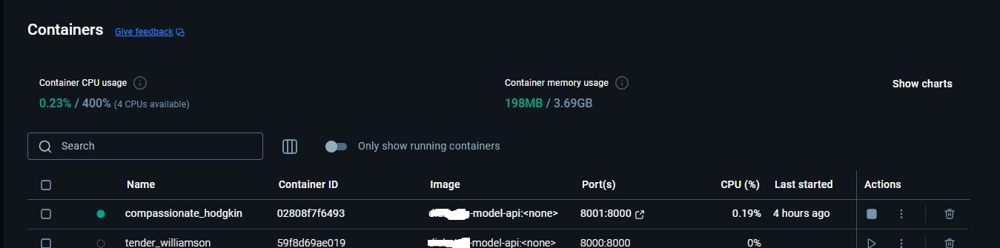
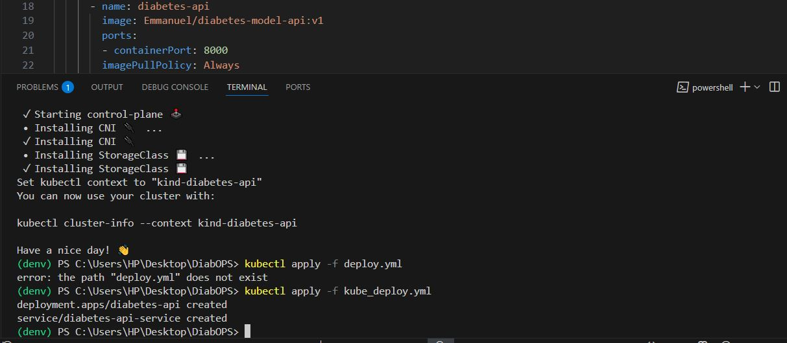
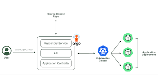
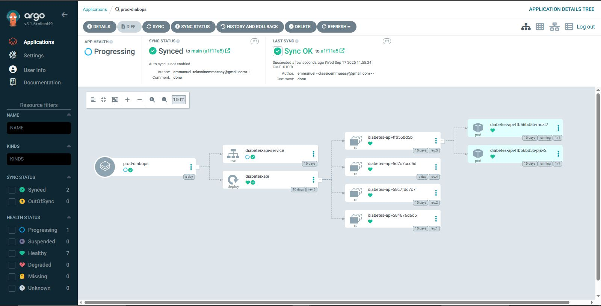

End to End Machine Learning project using a real-world chronic disease use case: predicting whether a person is diabetic based on health metrics. 


 I built an End to End Supervised Machine Learning pipelines that allow users or Medical Professionals  to input different features that could potentially cause diabetes and see the result real-time.
(FastAPI + Docker + K8s + Github Actions + AlgoCD)

The pipeline workflow are :

- ✅ Model Training
- ✅ Building the Model 
- ✅ API Deployment with FastAPI and a webpage for users to interact with the model. ( FastAPI enables multiple users concurently).
- ✅ Dockerization (packaging it into docker which takes my ML model with FastAPI + dependencies → packages them into a container image.)

- ✅ Kubernetes Deployment

   Kubernetes solves orchestration + scaling
   Run multiple replicas of the model API.
   Autoscale based on requests per second.
   Ensure uptime (self-healing).
   Roll out new versions of the model without downtime.

- ✅ CICD using github action
 it triggers an action anytime the code or the data changes, and automate the entire workflow in production

- ✅ Gitops using ArgoCD for deployment sync with github
---

## 📊 Problem Statement

Predict if a person is diabetic based on:
- Pregnancies
- Glucose
- Blood Pressure
- BMI
- Age

I use a Random Forest Classifier trained on the **Pima Diabetes Dataset**.

---

## 🚀 Quick Start

### 1. Clone the Repo

```bash
git clone https://github.com/iam-veeramalla/first-mlops-project.git
cd first-mlops-project
```

### 2. Create Virtual Environment

```
python3 -m venv .mlops
source .mlops/bin/activate
```

### 3. Install Dependencies

```
pip install -r requirements.txt
```

## Train the Model

```
python train.py
```

## Run the API Locally

```
uvicorn main:app --reload
```

### Sample Input for /predict json format

```
{
  "Pregnancies": 2,
  "Glucose": 130,
  "BloodPressure": 70,
  "BMI": 28.5,
  "Age": 45
}
```

## Dockerize the API

### Build the Docker Image

```
docker build -t diabetes-model-api .
```

### Docker Desktop

 
### Run the Container

```
docker run  -p 8001:8000 diabetes-model-api 
```

##### or any port 

## Deploy to Kubernetes

kubectl apply -f kube_deploy.yaml

```

```
## Setting Up ArgoCD to sync with github

```
```
 Make sure your repo contains the manifest(s) Argo CD should apply. For example either:

* `kube_deploy.yml` at the repo root, or
* a `kubernetes/` folder containing the manifests.

 Also, make sure you have your main..yml or ci.yaml in your .github/workflow folder

## Step 1 — Install Argo CD in your cluster

The official install applies a set of manifests into the `argocd` namespace.

```powershell
# (optional) make namespace first (manifest also creates it, but this is explicit)
kubectl create namespace argocd

# install Argo CD (stable manifests)
kubectl apply -n argocd -f https://raw.githubusercontent.com/argoproj/argo-cd/stable/manifests/install.yaml

# check pods
kubectl get pods -n argocd -w
```

Wait until `argocd-server` and the core pods have status `Running` (or at least `1/1` where applicable).

---

## Step 2 — Get the initial admin password (Windows PowerShell)

Argo CD creates a secret with the initial admin password. Decode it in PowerShell like this:

```powershell
$secret = kubectl -n argocd get secret argocd-initial-admin-secret -o jsonpath="{.data.password}"
[System.Text.Encoding]::UTF8.GetString([System.Convert]::FromBase64String($secret))
```

> Copy the printed password. (On Linux/macOS you can use: `kubectl -n argocd get secret argocd-initial-admin-secret -o jsonpath="{.data.password}" | base64 --decode`)

---

## Step 3 — Install Argo CD CLI (two options)

**Option A — Chocolatey (if you prefer)**

```powershell
choco install argocd-cli -y
# or force a specific version
choco install argocd-cli --version=2.12.3 --force -y
```

**Option B — Manual download (reliable)**

```powershell
# Run as Administrator
$version = "v2.12.3"  # pick a stable CLI version
$installPath = "C:\tools\argocd"
New-Item -ItemType Directory -Path $installPath -Force
Invoke-WebRequest -Uri "https://github.com/argoproj/argo-cd/releases/download/$version/argocd-windows-amd64.exe" -OutFile "$installPath\argocd.exe"
setx PATH "$($env:PATH);$installPath"
# Restart PowerShell after this so PATH updates take effect
```

Verify:

```powershell
argocd version
```

---

## Step 4 — Expose Argo CD server locally (port-forward)

Open a separate terminal and keep it running while you use the `argocd` CLI.

**Recommended (HTTPS):** forward a local port to Argo CD's 443 port inside the cluster:

```powershell
kubectl port-forward svc/argocd-server -n argocd 8080:443
```

If you prefer HTTP (not recommended for production), forward port 80 instead:

```powershell
kubectl port-forward svc/argocd-server -n argocd 8080:80
```

Confirm the service ports:

```powershell
kubectl get svc argocd-server -n argocd
```

---

## Step 5 — Log in with the CLI (PowerShell)

In a **different** PowerShell window, run:

```powershell
argocd login localhost:8080 --username admin --password <PASTE_PASSWORD_HERE> --insecure
```

* Use `--insecure` for local testing to skip cert verification of the self-signed cert.
* If you forwarded to a different port, adjust `localhost:8080` accordingly (e.g. `localhost:9090`).

---

## Step 6 — Create an Argo CD Application that points to your GitHub repo

**PowerShell multiline (use backtick \` for continuation)**

```powershell
argocd app create prod-diabops `
  --repo https://github.com/your-user/your-repo.git `
  --path . `
  --dest-server https://kubernetes.default.svc `
  --dest-namespace default `
  --revision main
```

**Or single-line version** (works on any shell):

```powershell
argocd app create prod-diabops --repo https://github.com/your-user/your-repo.git --path . --dest-server https://kubernetes.default.svc --dest-namespace default --revision main
```

**Notes**:

* `--path` should point to the folder inside the repo where your manifests live. Use `.` for repo root.
* `metadata.name` for the app (`prod-diabops`) must be lowercase and only include `a-z0-9`, `-`, or `.`.

---

## Step 7 — Sync the application (apply manifests to the cluster)

```powershell
argocd app sync prod-diabops
```
### Argo kubernetes pod synced with Github


Then verify status:

```powershell
argocd app get prod-diabops
kubectl get pods -n default
kubectl get svc -n default
```


